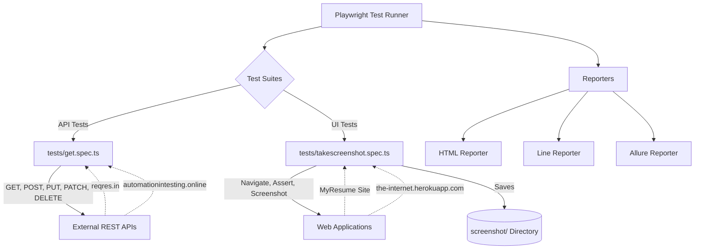

# Playwright Demo Project

This documentation provides a comprehensive overview of the `playwrightdemo` repository. This project serves as an automated testing framework built using Playwright, designed to validate both RESTful APIs and frontend User Interfaces (UIs).

## Table of Contents
- [Overview](#overview)
- [Architecture](#architecture)
- [Prerequisites](#prerequisites)
- [Installation](#installation)
- [Test Suites](#test-suites)
  - [API Testing](#api-testing)
  - [UI & Screenshot Testing](#ui--screenshot-testing)
- [Configuration](#configuration)
- [Reporting](#reporting)

## Overview

The `playwrightdemo` project leverages the `@playwright/test` library to ensure the reliability and functional correctness of various web services and applications. It acts as an executable specification and test suite, verifying:
- **API Integrity**: By executing CRUD (Create, Read, Update, Delete) operations against public REST endpoints.
- **UI Correctness**: By navigating to web applications, interacting with elements, asserting page properties (like titles), and capturing visual evidence via screenshots.

## Architecture

The following diagram illustrates the architecture and data flow of the test framework:



## Prerequisites

Before running the project, ensure you have the following installed on your machine:
- **Node.js**: (Version 20.x or above recommended)
- **npm**: Node Package Manager

## Installation

1. Clone the repository to your local machine.
2. Navigate to the project root directory.
3. Install the required project dependencies:
   ```bash
   npm install
   ```
4. Install the required Playwright browsers:
   ```bash
   npx playwright install
   ```

## Test Suites

The project organizes its tests into specialized suites located within the `tests/` directory.

### API Testing

**File:** `tests/get.spec.ts`

This suite demonstrates Playwright's `request` context capabilities to perform comprehensive API validations. It asserts on HTTP status codes and response payload contents to ensure the external APIs are behaving as expected.

| HTTP Method | Endpoint | Validation Focus |
| ----------- | -------- | ---------------- |
| `GET` | `https://automationintesting.online/booking/summary?roomid=1` | Status code `200` |
| `POST` | `https://reqres.in/api/users` | Status `201`, Payload data creation |
| `PUT` | `https://reqres.in/api/users/2` | Status `200`, Payload data total replacement |
| `PATCH` | `https://reqres.in/api/users/2` | Status `200`, Payload data partial update |
| `DELETE` | `https://reqres.in/api/users/2` | Status `204`, Successful deletion |

**Example Snippet:**
```typescript
test("API Post Response", async ({ request }) => {
  const response = await request.post("https://reqres.in/api/users", {
    data: { name: "morpheus", job: "leader" },
  });
  const body = await response.json();
  expect(response.status()).toBe(201);
  expect(body.name).toBe("morpheus");
});
```

### UI & Screenshot Testing

**File:** `tests/takescreenshot.spec.ts`

This suite leverages Playwright's browser automation to interact with user interfaces. It covers page navigation, element location, state assertions, and visual capture for debugging and historical recording.

| Test Scenario | Target URL | Actions & Assertions |
| ------------- | ---------- | -------------------- |
| Full Page Screenshot | `https://mitesh411.github.io/MyResume/` | Sets viewport to 1920x1080, captures `screenshot/fullpage.png` with `fullPage: true` |
| Element Screenshot | `https://the-internet.herokuapp.com/dropdown` | Locates `#dropdown`, captures `screenshot/element.png` |
| Title Verification | `https://mitesh411.github.io/MyResume/` | Asserts `page.title()` matches 'Mitesh Dandade - MyResume' |

*(Note: There is also a commented-out test demonstrating automatic screenshot capturing upon test failure during a login attempt.)*

## Configuration

**File:** `playwright.config.ts`

The framework is configured via `playwright.config.ts` to optimize test execution and reporting:
- **Parallel Execution:** `fullyParallel: true` enables running tests within files in parallel.
- **CI Enhancements:** Retries are set to `2` on CI environments, and workers are limited to `1`. The `forbidOnly` flag prevents accidental commits containing `.only` test filters.
- **Tracing & Debugging:** Playwright trace is collected on the first retry (`trace: 'on-first-retry'`).
- **Failure Analysis:** Screenshots are automatically captured only when tests fail (`screenshot: 'only-on-failure'`).
- **Browsers:** Currently configured to run locally against the **Desktop Chrome** environment via the `chromium` project.

## Reporting

The project is configured to generate multiple reports for analysis:
- **HTML Report:** Playwright's native interactive HTML report.
- **Line Report:** Clean terminal output during execution.
- **Allure Report:** Supported via `allure-playwright` plugin, offering detailed, rich visual representations of the test runs.

To view the Playwright HTML report after a test run:
```bash
npx playwright show-report
```
